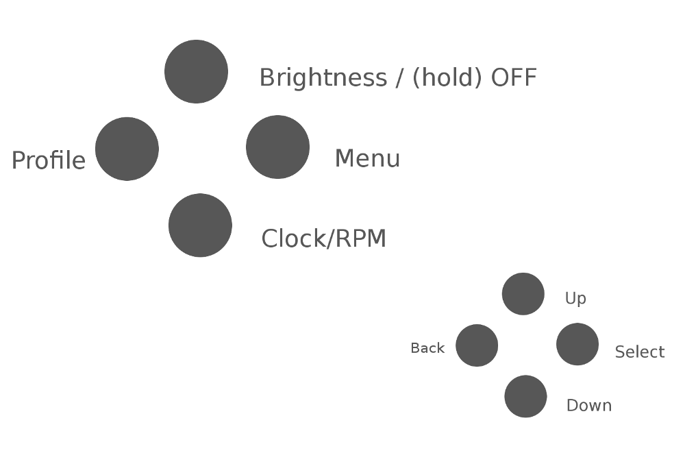

# Shift Light for Arduino

Uno/Nano compatible code that will drive a shift light.
Credits to [Chippernut](http://www.chippernut.com/forums.html#/20150817/schematics-and-code-3-4917820/) for the original version I based this off.

## Installation

1. Download and install each of the dependencies.
1. Double check the `_defines.h` file corresponds to your wiring.
1. Compile and upload using Arduino IDE 1.6.5+

### Dependencies

_' = Custom version, take from my repos or a fork of them._
_Should my changes get merged upstream I will modify this list._

* [Button](https://github.com/McSlow/Button)
* [EEPROMAnything](https://github.com/collin80/EEPROMAnything)
* [FastLED](https://github.com/FastLED/FastLED/tree/3.0.3)
* [FreqMeasure'](https://github.com/Beanow/FreqMeasure)
* [InterruptFreqMeasure](https://github.com/Beanow/InterruptFreqMeasure)
* [TM1637'](https://github.com/Beanow/TM1637)

## Menu structure

Displayed | Means | Range | Description
---------:|-------|-------|------------
`StAt` | Stationary RPM | 1000-`Acti` | The RPM value which is considered less than low-RPM. Low-RPM blinking will stop when below this value.
`Lo` | Low-RPM | `StAt`-`Acti` | The maximum RPM value that is considered low-RPM, shift down when passing this value.
`Acti` | Activation RPM | 1000-`ShFt` | The RPM value at which the first pixel will light up.
`ShFt` | Shift RPM | `Acti`-9900 | The RPM value after which the pixels will start flashing.
`Ani` | Animation | See below | The animation style displayed.
`ltr` | Left-to-Right | - | Animation style that will fill pixels from the left.
`rtl` | Right-to-Left | - | Animation style that will fill pixels from the right.
`Out` | Outward | - | Animation style that will fill from the center out.
`In` | Inward | - | Animation style that will fill from the edges inward.
`FULL` | Full bar | - | Animation style that uses color and flashing only, alwasys a filled bar. (Experimental)
`CLrS` | Colors | See below | Allows you to enter a sub-menu for editing the pixel colors.
`C Lo` | Color Low-RPM | Color | The color to use for Low-RPM indicator.
`CPt1` | Color Part 1 | Color | The first color for the chosen animation style, when between `Acti` and `ShFt`.
`CPt2` | Color Part 2 | Color | The second color for the chosen animation style, when between `Acti` and `ShFt`.
`CPt3` | Color Part 3 | Color | The third color for the chosen animation style, when between `Acti` and `ShFt`.
`CFL1` | Color Flash 1 | Color | The first color used for shift flashing, after `ShFt` value.
`CFL2` | Color Flash 2 | Color + Black | The second color used for shift flashing, after `ShFt` value.
`Lcd` | LCD Brightness | 1-8 | The brightness value for the 7-seg LCD display.
`SteP` | RPM Steps | 1, 2, 5, 10, 20, 50, 100 | Rounds the RPM value displayed on the LCD. (Does not affect calculations/animations.)
`ti` | Time | See below | Allows you to set the date and time.
`20##` | Year | 2000-2099 | Sets the current year.
`n ##` | Nonth | 1-12 | Sets the current nonth (n is used because m can't be displayed on the 7-seg display).
`d ##` | Date | 1-31 | Sets the current date.
`##:00` | Hour | 0-23 | Sets the current hour.
`00:##` | Minute | 0-59 | Sets the current minute.
`PPr` | Pulses Per Revolution | 1-12 | The amount of pulses your vehicle's ECU sends per revolution. Depends mainly on the amount of cylincers.
`BuFF` | Buffer | yes/no | Whether or not to use a buffer to smooth out RPM readings.
`tyPe` | RPM Measurement Type | 1-2 | The type of measurement to do to get the RPM signal. 1 = Interrupt based, 2 = Timer1 based.
`rSet` | Reset | See below | Will reset all configuration to default values.
`Sure` | Are you sure? | - | Confirmation that you want to reset to default values.
